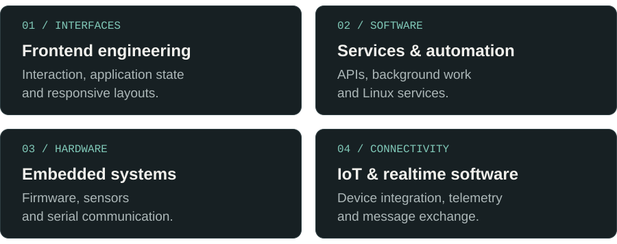
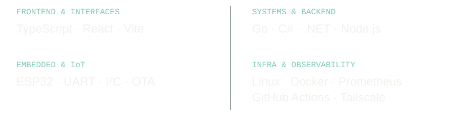
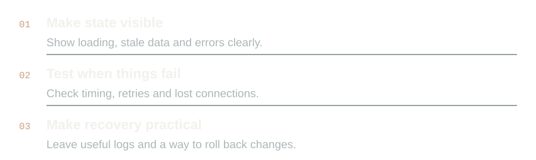

<!-- Generated by scripts/render-assets.py. Edit copy and layout there. -->

<a href="./README.md">Português</a> · <strong>English</strong>

<picture>
  <source media="(max-width: 767px) and (prefers-color-scheme: dark)" srcset="./assets/en/hero-mobile-dark.svg">
  <source media="(max-width: 767px)" srcset="./assets/en/hero-mobile-light.svg">
  <source media="(prefers-color-scheme: dark)" srcset="./assets/en/hero-desktop-dark.svg">
  <source media="(prefers-color-scheme: light)" srcset="./assets/en/hero-desktop-light.svg">
  
</picture>

<picture>
  <source media="(max-width: 767px) and (prefers-color-scheme: dark)" srcset="./assets/en/console-mobile-dark.svg">
  <source media="(max-width: 767px)" srcset="./assets/en/console-mobile-light.svg">
  <source media="(prefers-color-scheme: dark)" srcset="./assets/en/console-desktop-dark.svg">
  <source media="(prefers-color-scheme: light)" srcset="./assets/en/console-desktop-light.svg">
  
</picture>

## About

I work on software and connected systems, including Linux services, automation, telemetry, embedded systems and web interfaces. I like understanding how the parts communicate and what happens when something fails.

## Fields I work in

<picture>
  <source media="(max-width: 767px) and (prefers-color-scheme: dark)" srcset="./assets/en/fields-mobile-dark.svg">
  <source media="(max-width: 767px)" srcset="./assets/en/fields-mobile-light.svg">
  <source media="(prefers-color-scheme: dark)" srcset="./assets/en/fields-desktop-dark.svg">
  <source media="(prefers-color-scheme: light)" srcset="./assets/en/fields-desktop-light.svg">
  
</picture>

## Toolbox

<picture>
  <source media="(max-width: 767px) and (prefers-color-scheme: dark)" srcset="./assets/en/toolbox-mobile-dark.svg">
  <source media="(max-width: 767px)" srcset="./assets/en/toolbox-mobile-light.svg">
  <source media="(prefers-color-scheme: dark)" srcset="./assets/en/toolbox-desktop-dark.svg">
  <source media="(prefers-color-scheme: light)" srcset="./assets/en/toolbox-desktop-light.svg">
  
</picture>

## How I like to build

<picture>
  <source media="(max-width: 767px) and (prefers-color-scheme: dark)" srcset="./assets/en/build-mobile-dark.svg">
  <source media="(max-width: 767px)" srcset="./assets/en/build-mobile-light.svg">
  <source media="(prefers-color-scheme: dark)" srcset="./assets/en/build-desktop-dark.svg">
  <source media="(prefers-color-scheme: light)" srcset="./assets/en/build-desktop-light.svg">
  
</picture>

## Technical interests

<picture>
  <source media="(max-width: 767px) and (prefers-color-scheme: dark)" srcset="./assets/en/interests-mobile-dark.svg">
  <source media="(max-width: 767px)" srcset="./assets/en/interests-mobile-light.svg">
  <source media="(prefers-color-scheme: dark)" srcset="./assets/en/interests-desktop-dark.svg">
  <source media="(prefers-color-scheme: light)" srcset="./assets/en/interests-desktop-light.svg">
  
</picture>

## GitHub activity

<picture>
  <source media="(prefers-color-scheme: dark)" srcset="https://raw.githubusercontent.com/butteerflly/butteerflly/output/github-contribution-grid-snake-dark.svg">
  <source media="(prefers-color-scheme: light)" srcset="https://raw.githubusercontent.com/butteerflly/butteerflly/output/github-contribution-grid-snake.svg">
  
</picture>

<picture>
  <source media="(max-width: 767px) and (prefers-color-scheme: dark)" srcset="./assets/en/footer-mobile-dark.svg">
  <source media="(max-width: 767px)" srcset="./assets/en/footer-mobile-light.svg">
  <source media="(prefers-color-scheme: dark)" srcset="./assets/en/footer-desktop-dark.svg">
  <source media="(prefers-color-scheme: light)" srcset="./assets/en/footer-desktop-light.svg">
  
</picture>

