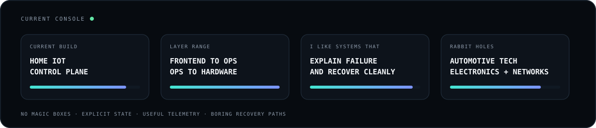
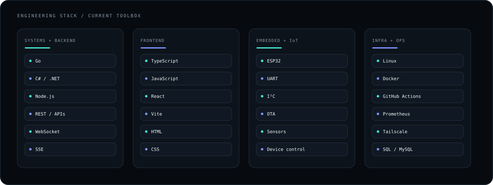

<picture>
  <source media="(prefers-color-scheme: dark)" srcset="./assets/profile-header-dark.svg">
  <source media="(prefers-color-scheme: light)" srcset="./assets/profile-header-light.svg">
  
</picture>

 

  <code>software systems</code>
  <code>linux</code>
  <code>embedded</code>
  <code>realtime</code>
  <code>automation</code>

 

<picture>
  <source media="(prefers-color-scheme: dark)" srcset="./assets/operator-console-dark.svg">
  <source media="(prefers-color-scheme: light)" srcset="./assets/operator-console-light.svg">
  
</picture>

## About

I like building things where several layers have to cooperate for the result to actually work.

Most of my projects move between **web interfaces, backend services, Linux infrastructure, networks and embedded devices**. I care a lot about knowing what a system is doing, why it failed and how to recover it without guesswork.

If there is a browser on one side and a sensor, machine or service on the other, I will probably find it interesting.

`📍 Somewhere in New Mexico`

 

## Currently building

<picture>
  <source media="(prefers-color-scheme: dark)" srcset="./assets/home-iot-dark.svg">
  <source media="(prefers-color-scheme: light)" srcset="./assets/home-iot-light.svg">
  
</picture>

### Home IoT / Leonida Home IoT Core

Home IoT started as automation and kept growing.

Today it is a private control plane for my home, workshop and development infrastructure. It ties together remote nodes, device control, environmental sensing, presence detection, telemetry, monitoring, OTA updates and recovery paths.

The goal is pretty simple. I want to know what is happening, control things remotely and still have a way back when one piece decides to die.

Private repository · active development

 

## Toolbox

<picture>
  <source media="(prefers-color-scheme: dark)" srcset="./assets/stack-dark.svg">
  <source media="(prefers-color-scheme: light)" srcset="./assets/stack-light.svg">
  
</picture>

I also have older code and experiments in **PHP, Lua and Python**. The stack changes with the problem. I am much more interested in making the layers fit together than collecting logos.

 

## How I like to build

<picture>
  <source media="(prefers-color-scheme: dark)" srcset="./assets/system-map-dark.svg">
  <source media="(prefers-color-scheme: light)" srcset="./assets/system-map-light.svg">
  
</picture>

I like **explicit state, useful telemetry, clear boundaries and recovery paths that are boring on purpose**.

Hidden magic is fun right up until it breaks at 3 AM.

 

## Things I keep going down rabbit holes about

`Distributed systems` · `Embedded systems` · `IoT` · `Observability` · `Automotive technology` · `Electronics` · `Networking` · `Realtime systems` · `Automation` · `Human machine interfaces`

 

## GitHub activity

<picture>
  <source media="(prefers-color-scheme: dark)" srcset="https://raw.githubusercontent.com/butteerflly/butteerflly/output/github-contribution-grid-snake-dark.svg">
  <source media="(prefers-color-scheme: light)" srcset="https://raw.githubusercontent.com/butteerflly/butteerflly/output/github-contribution-grid-snake.svg">
  
</picture>

 

<picture>
  <source media="(prefers-color-scheme: dark)" srcset="./assets/footer-dark.svg">
  <source media="(prefers-color-scheme: light)" srcset="./assets/footer-light.svg">
  
</picture>
