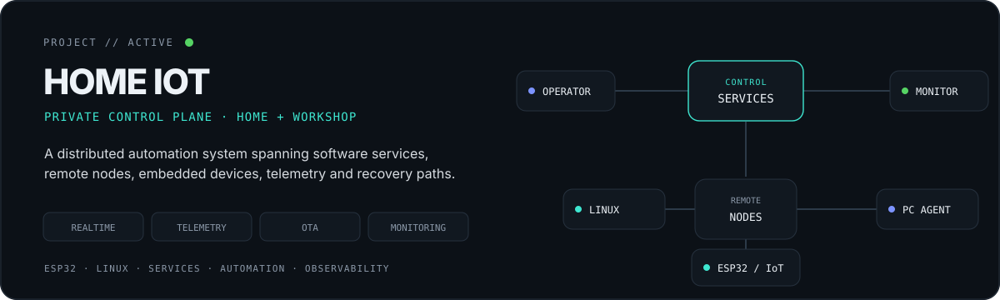
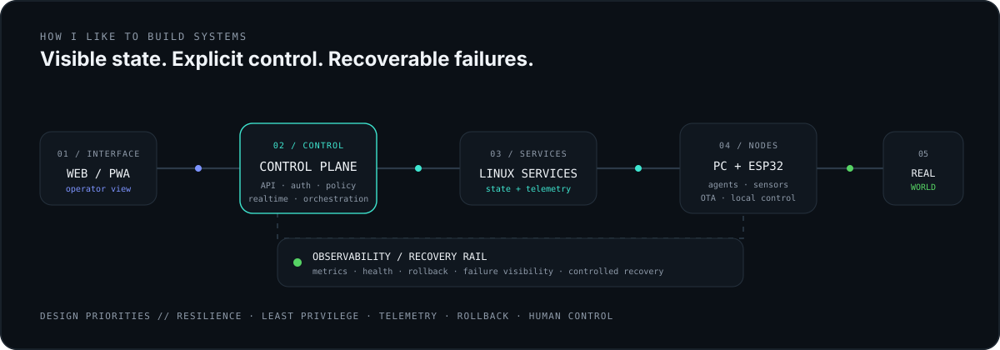

<picture>
  <source media="(prefers-color-scheme: dark)" srcset="./assets/profile-header-dark.svg">
  <source media="(prefers-color-scheme: light)" srcset="./assets/profile-header-light.svg">
  
</picture>

  <strong>Building software that connects infrastructure, devices and the physical world.</strong>

 

## `01 / ABOUT`

I build end-to-end systems across **web applications, backend services, Linux infrastructure and embedded/IoT devices**.

My current focus is **distributed control, realtime telemetry, resilient services, automation and operator-facing interfaces** — the part where software stops being just a screen and starts interacting with actual machines, sensors and networks.

`📍 Somewhere in New Mexico`

---

## `02 / CURRENTLY BUILDING`

<picture>
  <source media="(prefers-color-scheme: dark)" srcset="./assets/home-iot-dark.svg">
  <source media="(prefers-color-scheme: light)" srcset="./assets/home-iot-light.svg">
  
</picture>

### Home IoT / Leonida Home IoT Core

A private control plane for personal home and workshop infrastructure. It brings together **remote nodes, device control, environmental sensing, presence detection, realtime telemetry, monitoring, OTA delivery and recovery paths** under one system.

The interesting part is not any single device. It is making the whole thing remain **observable, recoverable and controllable when individual pieces fail**.

Private repository · active development

---

## `03 / HOW I BUILD`

<picture>
  <source media="(prefers-color-scheme: dark)" srcset="./assets/system-map-dark.svg">
  <source media="(prefers-color-scheme: light)" srcset="./assets/system-map-light.svg">
  
</picture>

I prefer systems with **explicit state, visible failures, controlled recovery and clear boundaries** between UI, control logic, infrastructure and hardware.

---

## `04 / ENGINEERING STACK`

| Area | Technologies & concepts |
| --- | --- |
| **Systems & Backend** | `Go` · `C# / .NET` · `Node.js` · `REST` · `WebSocket` · `SSE` |
| **Frontend** | `TypeScript` · `JavaScript` · `React` · `Vite` · `HTML` · `CSS` |
| **Embedded / IoT** | `ESP32` · `UART` · `I²C` · `OTA` · sensor integration |
| **Infrastructure / Ops** | `Linux` · `Docker` · `GitHub Actions` · `Prometheus` · `Tailscale` |
| **Data / Tooling** | `SQL` · `MySQL` · `Python` |
| **Also worked with** | `PHP` · `Lua` |

---

## `05 / ENGINEERING INTERESTS`

`Distributed Systems` · `Embedded Systems` · `IoT` · `Observability` · `Infrastructure` · `Realtime Systems` · `Automation` · `Automotive Technology` · `Human–Machine Interfaces`

---

## `06 / GITHUB ACTIVITY`

<picture>
  <source media="(prefers-color-scheme: dark)" srcset="https://raw.githubusercontent.com/butteerflly/butteerflly/output/github-contribution-grid-snake-dark.svg">
  <source media="(prefers-color-scheme: light)" srcset="https://raw.githubusercontent.com/butteerflly/butteerflly/output/github-contribution-grid-snake.svg">
  
</picture>

---

## `07 / CONTACT`

**GitHub:** [@butteerflly](https://github.com/butteerflly)  
**Discord:** `.butterflly`

Systems, experiments and the engineering behind them.
