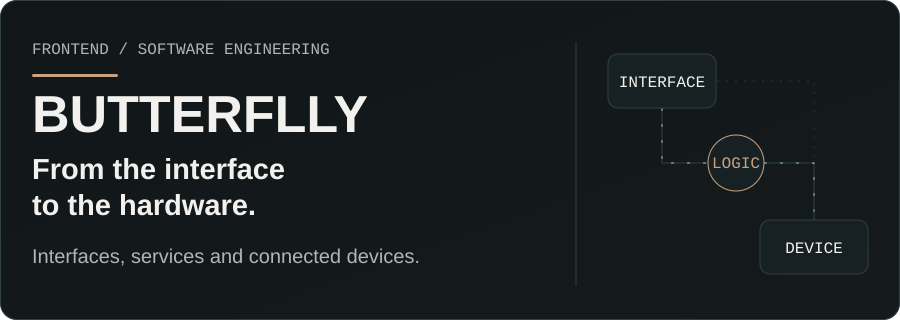
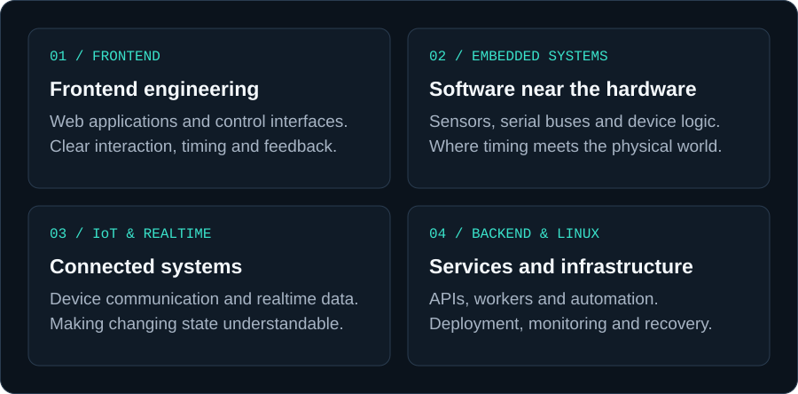
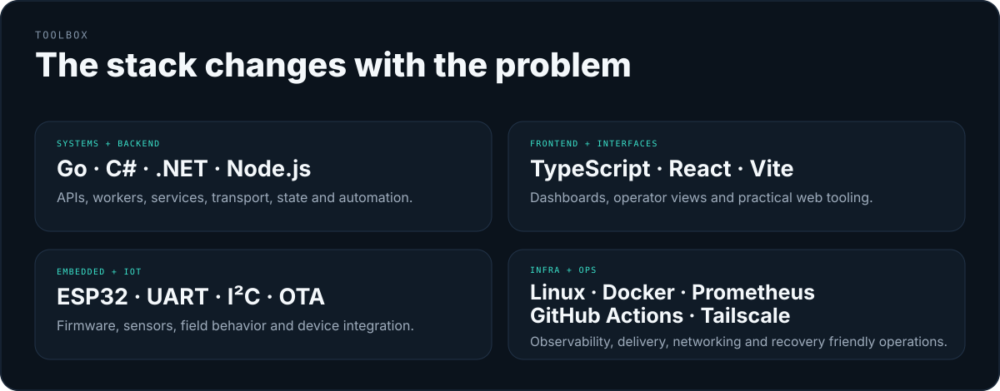
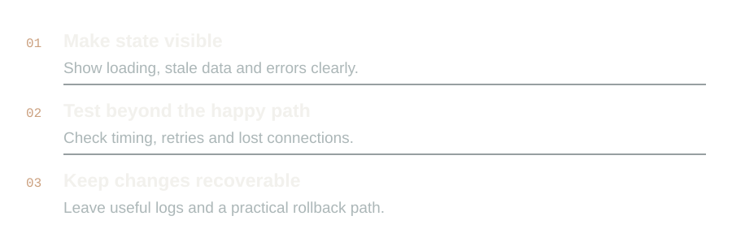
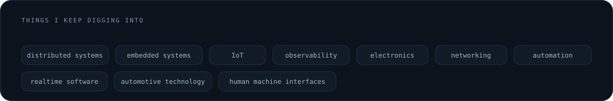
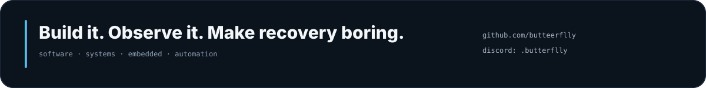

<picture>
  <source media="(prefers-color-scheme: dark)" srcset="./assets/hero-v5-dark.svg">
  <source media="(prefers-color-scheme: light)" srcset="./assets/hero-v5-light.svg">
  
</picture>

 

<picture>
  <source media="(prefers-color-scheme: dark)" srcset="./assets/console-v5-dark.svg">
  <source media="(prefers-color-scheme: light)" srcset="./assets/console-v5-light.svg">
  
</picture>

## About

I like working on systems that have to make sense across more than one layer.

Most of what I do sits somewhere between **interfaces, backend services, Linux environments, device communication and embedded hardware**. I care about visibility, state, recovery and the small details that make a system easier to trust.

I keep active project specifics private. This profile is about the kind of work I do, not a public log of everything I am building.

`📍 Somewhere in New Mexico`

 

## Fields I work in

<picture>
  <source media="(prefers-color-scheme: dark)" srcset="./assets/fields-v5-dark.svg">
  <source media="(prefers-color-scheme: light)" srcset="./assets/fields-v5-light.svg">
  
</picture>

 

## Toolbox

<picture>
  <source media="(prefers-color-scheme: dark)" srcset="./assets/toolbox-v5-dark.svg">
  <source media="(prefers-color-scheme: light)" srcset="./assets/toolbox-v5-light.svg">
  
</picture>

I have also worked with PHP, Lua, Python, SQL and MySQL when they fit the job.

  

## How I like to build

<picture>
  <source media="(prefers-color-scheme: dark)" srcset="./assets/build-v5-dark.svg">
  <source media="(prefers-color-scheme: light)" srcset="./assets/build-v5-light.svg">
  
</picture>

 

<picture>
  <source media="(prefers-color-scheme: dark)" srcset="./assets/interests-v5-dark.svg">
  <source media="(prefers-color-scheme: light)" srcset="./assets/interests-v5-light.svg">
  
</picture>

 

## GitHub activity

<picture>
  <source media="(prefers-color-scheme: dark)" srcset="https://raw.githubusercontent.com/butteerflly/butteerflly/output/github-contribution-grid-snake-dark.svg">
  <source media="(prefers-color-scheme: light)" srcset="https://raw.githubusercontent.com/butteerflly/butteerflly/output/github-contribution-grid-snake.svg">
  
</picture>

 

<picture>
  <source media="(prefers-color-scheme: dark)" srcset="./assets/footer-v5-dark.svg">
  <source media="(prefers-color-scheme: light)" srcset="./assets/footer-v5-light.svg">
  
</picture>
