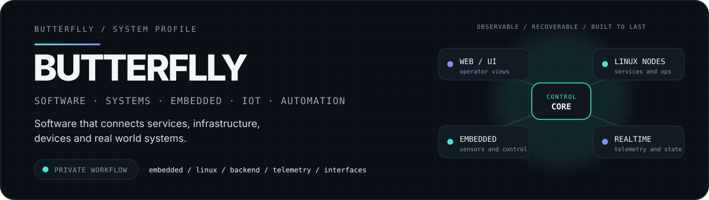
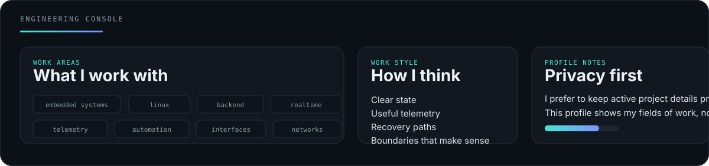
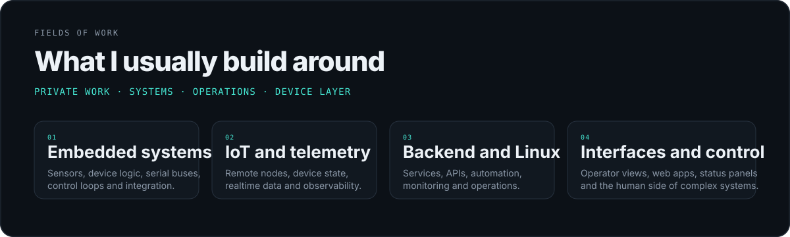
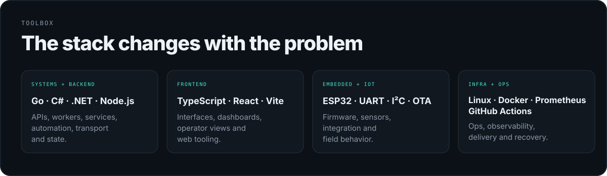
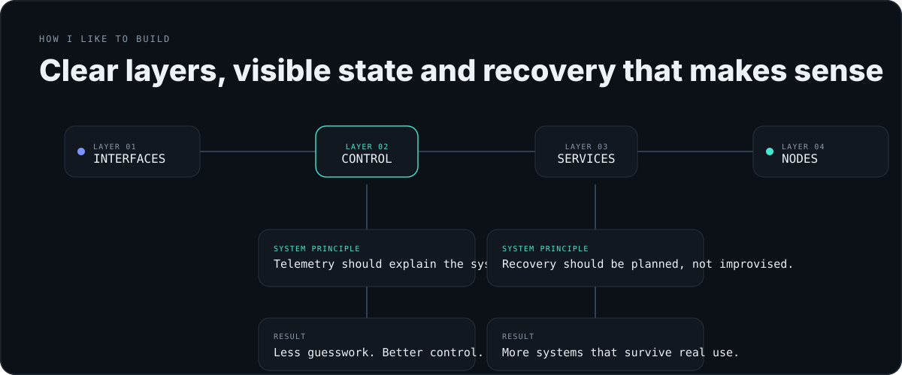
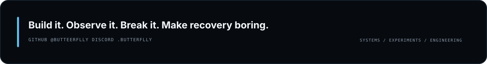

<picture>
  <source media="(prefers-color-scheme: dark)" srcset="./assets/profile-header-v3-dark.svg">
  <source media="(prefers-color-scheme: light)" srcset="./assets/profile-header-v3-light.svg">
  
</picture>

 

  <code>software systems</code>
  <code>embedded</code>
  <code>iot</code>
  <code>linux</code>
  <code>realtime</code>
  <code>automation</code>

 

<picture>
  <source media="(prefers-color-scheme: dark)" srcset="./assets/operator-console-v3-dark.svg">
  <source media="(prefers-color-scheme: light)" srcset="./assets/operator-console-v3-light.svg">
  
</picture>

## About

I like working on systems that have to make sense across more than one layer.

Most of what I do sits somewhere between **interfaces, backend services, Linux environments, device communication and embedded hardware**. I care about visibility, state, recovery and the small details that make a system easier to trust.

I keep active project specifics private. This profile is about the kind of work I do, not a public log of everything I am building.

`📍 Somewhere in New Mexico`

 

## Fields I work in

<picture>
  <source media="(prefers-color-scheme: dark)" srcset="./assets/fields-v3-dark.svg">
  <source media="(prefers-color-scheme: light)" srcset="./assets/fields-v3-light.svg">
  
</picture>

I usually end up in work where software has to talk to something real, whether that means a service, a machine, a node on a network or a device sitting on a bench.

 

## Toolbox

<picture>
  <source media="(prefers-color-scheme: dark)" srcset="./assets/toolbox-v3-dark.svg">
  <source media="(prefers-color-scheme: light)" srcset="./assets/toolbox-v3-light.svg">
  
</picture>

I have also worked with **PHP, Lua, Python, SQL and MySQL** when they fit the job. The stack changes with the problem.

 

## How I like to build

<picture>
  <source media="(prefers-color-scheme: dark)" srcset="./assets/build-map-v3-dark.svg">
  <source media="(prefers-color-scheme: light)" srcset="./assets/build-map-v3-light.svg">
  
</picture>

I like clear responsibilities, useful telemetry, simple control paths and recovery that has been thought through before something goes wrong.

If a system cannot explain its own state, I usually keep pushing until it can.

 

## Things I keep digging into

`Distributed systems` · `Embedded systems` · `IoT` · `Observability` · `Electronics` · `Networking` · `Realtime software` · `Automation` · `Automotive technology` · `Human machine interfaces`

 

## GitHub activity

<picture>
  <source media="(prefers-color-scheme: dark)" srcset="https://raw.githubusercontent.com/butteerflly/butteerflly/output/github-contribution-grid-snake-dark.svg">
  <source media="(prefers-color-scheme: light)" srcset="https://raw.githubusercontent.com/butteerflly/butteerflly/output/github-contribution-grid-snake.svg">
  
</picture>

 

<picture>
  <source media="(prefers-color-scheme: dark)" srcset="./assets/footer-dark.svg">
  <source media="(prefers-color-scheme: light)" srcset="./assets/footer-light.svg">
  
</picture>
