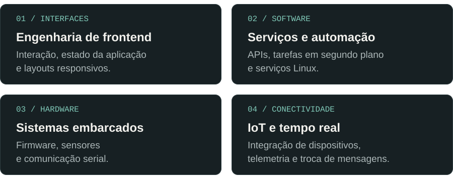
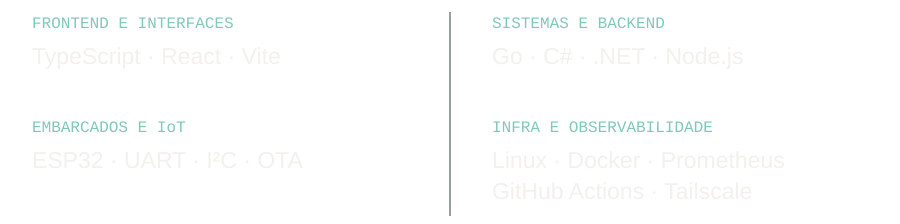
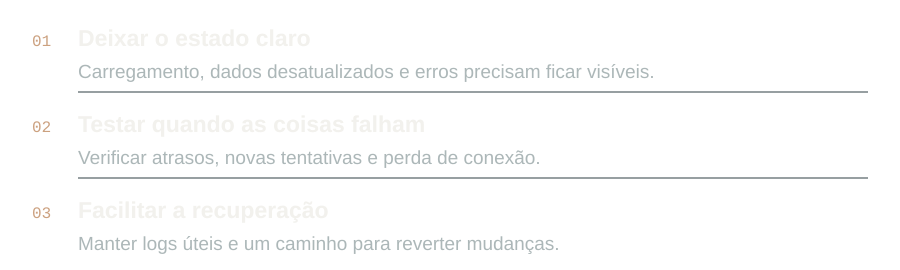

<!-- Generated by scripts/render-assets.py. Edit copy and layout there. -->

<strong>Português</strong> · <a href="./README.en.md">English</a>

<picture>
  <source media="(max-width: 767px) and (prefers-color-scheme: dark)" srcset="./assets/pt-br/hero-mobile-dark.svg">
  <source media="(max-width: 767px)" srcset="./assets/pt-br/hero-mobile-light.svg">
  <source media="(prefers-color-scheme: dark)" srcset="./assets/pt-br/hero-desktop-dark.svg">
  <source media="(prefers-color-scheme: light)" srcset="./assets/pt-br/hero-desktop-light.svg">
  
</picture>

<picture>
  <source media="(max-width: 767px) and (prefers-color-scheme: dark)" srcset="./assets/pt-br/console-mobile-dark.svg">
  <source media="(max-width: 767px)" srcset="./assets/pt-br/console-mobile-light.svg">
  <source media="(prefers-color-scheme: dark)" srcset="./assets/pt-br/console-desktop-dark.svg">
  <source media="(prefers-color-scheme: light)" srcset="./assets/pt-br/console-desktop-light.svg">
  
</picture>

## Sobre mim

Trabalho com interfaces web, serviços de backend, Linux e sistemas embarcados. Gosto de investigar problemas que passam por essas áreas, principalmente quando envolvem comunicação com dispositivos ou o tempo de resposta do sistema.

## Áreas de atuação

<picture>
  <source media="(max-width: 767px) and (prefers-color-scheme: dark)" srcset="./assets/pt-br/fields-mobile-dark.svg">
  <source media="(max-width: 767px)" srcset="./assets/pt-br/fields-mobile-light.svg">
  <source media="(prefers-color-scheme: dark)" srcset="./assets/pt-br/fields-desktop-dark.svg">
  <source media="(prefers-color-scheme: light)" srcset="./assets/pt-br/fields-desktop-light.svg">
  
</picture>

## Ferramentas

<picture>
  <source media="(max-width: 767px) and (prefers-color-scheme: dark)" srcset="./assets/pt-br/toolbox-mobile-dark.svg">
  <source media="(max-width: 767px)" srcset="./assets/pt-br/toolbox-mobile-light.svg">
  <source media="(prefers-color-scheme: dark)" srcset="./assets/pt-br/toolbox-desktop-dark.svg">
  <source media="(prefers-color-scheme: light)" srcset="./assets/pt-br/toolbox-desktop-light.svg">
  
</picture>

## Como gosto de trabalhar

<picture>
  <source media="(max-width: 767px) and (prefers-color-scheme: dark)" srcset="./assets/pt-br/build-mobile-dark.svg">
  <source media="(max-width: 767px)" srcset="./assets/pt-br/build-mobile-light.svg">
  <source media="(prefers-color-scheme: dark)" srcset="./assets/pt-br/build-desktop-dark.svg">
  <source media="(prefers-color-scheme: light)" srcset="./assets/pt-br/build-desktop-light.svg">
  
</picture>

## Interesses técnicos

<picture>
  <source media="(max-width: 767px) and (prefers-color-scheme: dark)" srcset="./assets/pt-br/interests-mobile-dark.svg">
  <source media="(max-width: 767px)" srcset="./assets/pt-br/interests-mobile-light.svg">
  <source media="(prefers-color-scheme: dark)" srcset="./assets/pt-br/interests-desktop-dark.svg">
  <source media="(prefers-color-scheme: light)" srcset="./assets/pt-br/interests-desktop-light.svg">
  
</picture>

## Atividade no GitHub

<picture>
  <source media="(prefers-color-scheme: dark)" srcset="https://raw.githubusercontent.com/butteerflly/butteerflly/output/github-contribution-grid-snake-dark.svg">
  <source media="(prefers-color-scheme: light)" srcset="https://raw.githubusercontent.com/butteerflly/butteerflly/output/github-contribution-grid-snake.svg">
  
</picture>

<picture>
  <source media="(max-width: 767px) and (prefers-color-scheme: dark)" srcset="./assets/pt-br/footer-mobile-dark.svg">
  <source media="(max-width: 767px)" srcset="./assets/pt-br/footer-mobile-light.svg">
  <source media="(prefers-color-scheme: dark)" srcset="./assets/pt-br/footer-desktop-dark.svg">
  <source media="(prefers-color-scheme: light)" srcset="./assets/pt-br/footer-desktop-light.svg">
  
</picture>

